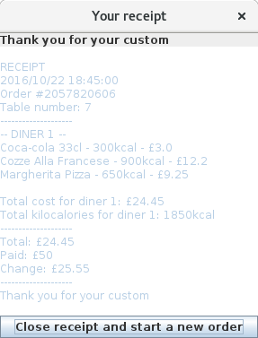

restaurant-menu-selector
========================
Assignment for Year 1 module Software Design and Development.

It is a program that is meant to be used in a restaurant to allow customers order food by themselves on a tablet.

It has been written in Java using Swing GUI components, so it should work on any platform.

Screenshots
-----------
Some screenshots of the app below.

Order screen
~~~~~~~~~~~~
  
.. image:: Screenshots/order%20screen.png

Courses choice
~~~~~~~~~~~~~~

.. image:: Screenshots/courses%20choice.png

Payment dialog
~~~~~~~~~~~~~~

.. image:: Screenshots/order%20payment.png

Receipt
~~~~~~~

